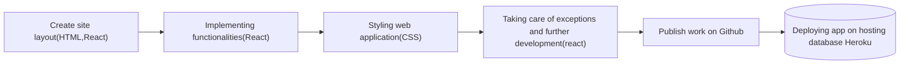

# online-editor
# Getting Started with Create React App

At first write the command [npx create-react-app online-editor].This will initialize the node modules and create a react app.
This project was bootstrapped with [Create React App](https://github.com/facebook/create-react-app).

## Available Scripts

In the project directory, you can run:

### `npm start`

Runs the app in the development mode.\
Open [http://localhost:3000](http://localhost:3000) to view it in your browser.

The page will reload when you make changes.\
You may also see any lint errors in the console.

### `npm run build`

Builds the app for production to the `build` folder.\
It correctly bundles React in production mode and optimizes the build for the best performance.

The build is minified and the filenames include the hashes.\
Your app is ready to be deployed!

See the section about [deployment](https://facebook.github.io/create-react-app/docs/deployment) for more information.

### About Project

An online code editor for HTML, CSS, JS code snippets using only HTML, CSS, and
React. The code editor’s functionality is similar to that of codpen.io. It provides a liberty of using a local code editor. It is fast, efficient, and most important thing is it is very much uselful for developers.

### Project Stages

### High level Approach
High-Level Approach
This module consists of the following milestones:
- Creating the structural aspect of code editor using HTML, CSS
- Implementation of core functionalities and other frontend features using React
- Publish to GitHub and finally host your deployed code editor.

### Applications

Some of the applications of online code editors are-
- For online interviews/hiring: With online code editors, you can do interviews with
ease. It helps to see candidates’ approach towards solutions and work with code.
- Prototyping: You can validate your ideas and get instant feedback from users as
sharing and collaboration options are available and save you from the pain of local
setup

### Features
- Auto Completion
- Toggle Comment
- Searching and replacing words
- Jump to line
- Syntax Highlighting
- Displaying line numbers
- AutoSave Enabled
- Refresh option
- Toggle window
- Easy to use

### Demo

https://user-images.githubusercontent.com/88088520/173194823-aa07fc34-cfb5-4c77-a3dc-1d9b23d53c9a.mp4

### Deployment Link
https://code-editorv1.herokuapp.com/
